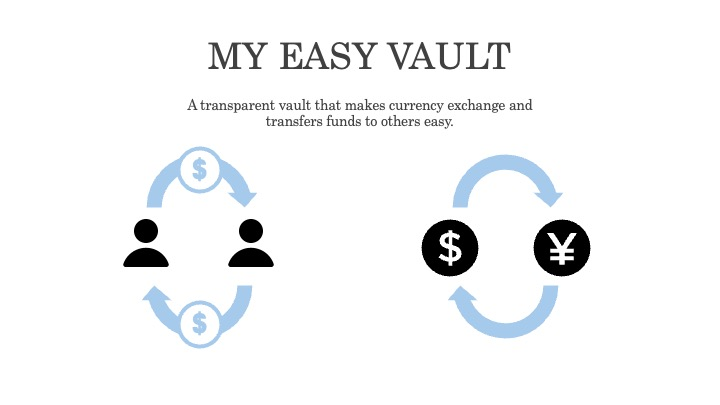

# My Easy Vault 2026



Josh's side project: a lightweight Vault backend built with Go.
My easy vault is a transparent vault that makes currency exchange and transfers funds to others easy.
It focuses on core money-flow capabilities, including wallet management, currency exchange, peer transfers, and transaction history.

## Project Positioning

This project aims to be a "simple but engineering-focused" backend for fund operations, with emphasis on:
- Clear three-layer architecture: `handler -> service -> dao`
- Maintainable data-access design
- Production-friendly access control and rate limiting

## Core Features

- User login/register and logout (token-based)
- Wallet creation and listing
- Exchange rate query
- Currency exchange (Preview / Confirm)
- Peer-to-peer transfer (Preview / Confirm)
- Paginated transaction history
- Test route for fund top-up simulation (`/test/account/addAssets`)

## Key Highlights

### 1) Middleware: Access Control + Rate Limiting

Applied consistently at the routing layer:
- `ApiAuthorityMiddleWare`: validates API permissions, parses token, and injects auth context
- `RateLimitMiddleWare`: applies leaky-bucket based throttling by permission rules, and returns `X-RateLimit-*` headers

This keeps security and traffic control centralized at the entry point, so business code stays clean.

### 2) DAO: Improved ORM Design

The DAO layer uses unified query objects with composable Scope chains. Key patterns include:
- `Query` structs + `queryChain` to assemble where/in/order/page conditions consistently
- `WithTx` for transaction-aware DAO switching with lower coupling
- Dynamic `Update` field mapping to reduce repetitive SQL boilerplate

This improves maintainability, readability, and long-term extensibility in the data layer.

### 3) L2 Cache: Non-Intrusive Cached Query

`infra/L2CQuery` provides a generic cache wrapper for queries:
- Auto-generates cache keys from SQL
- Reads from Redis first, falls back to DB on cache miss
- Writes cache back and maintains table/key relationship sets

Service code only needs to wrap query functions once, without scattering cache logic across business modules.

## Tech Stack

- Language: Go (`go1.23`)
- API: Gin
- DI: Uber Fx
- DB: MySQL + GORM (with read/write splitting plugin)
- Cache / MQ: Redis (cache, lock, queue/pubsub)
- Tooling: Cobra, Viper, Swagger

## Project Structure (Excerpt)

```text
api-server/
  api/            # handlers, routers, middlewares
  services/       # business logic
  dao/            # data access and ORM composition
  infra/          # DB/Redis/MQ/L2 cache/lock/router
  docs/           # swagger docs
```

## Quick Start (Local)

```bash
cd api-server
cp .env.example .env
go run main.go serve
```

Or with Docker:

```bash
cd api-server
docker compose -f docker/docker-compose.yml up --build
```

## Notes

This is an actively evolving side project by Josh, intended to become a practical and extensible backend template for Vault-like systems.
